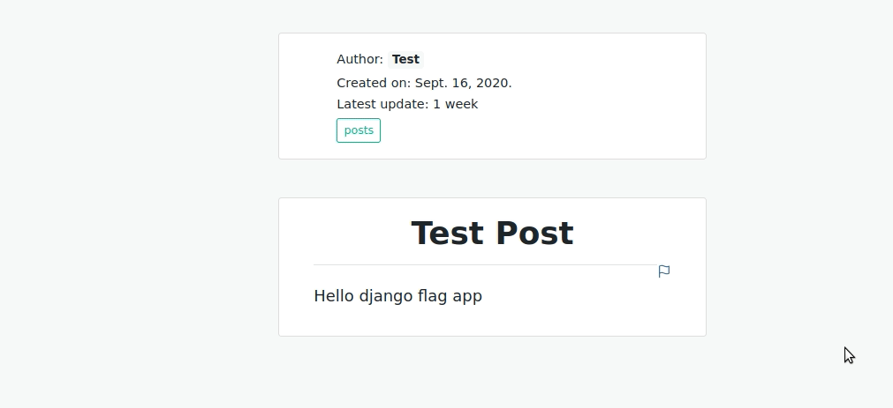

## django-flag-app

[](https://travis-ci.org/abhiabhi94/django-flag-app)
[](https://coveralls.io/github/abhiabhi94/django-flag-app?branch=master)

A pluggable django application to add flagging to your models.



### Installation

Install using `pip`
```bash
$ pip install django-flag-app
```

If you want, you may install it from the source, grab the source code and run `setup.py`.

```bash
$ git clone git://github.com/abhiabhi94/django-flag-app.git
$ cd django-flag-app
$ python setup.py install
```
### Usage

- #### Add app

To enable `django_flag_app` in your project you need to add it to `INSTALLED_APPS` in your projects `settings.py` file:

```python

INSTALLED_APPS = (
    ...
    'flag',
    ...
)
```
- #### Add url

In `urls.py`:

```python

urlpatterns = patterns(
        path('admin/', admin.site.urls),
        path('flag/', include('flag.urls')),
        ...
        path('api/', include('flag.api.urls')),  # only required for API Framework
        ...
    )
```

- #### Migrate

Run the migrations to add the new models to your database:

```python

python manage.py migrate flag
```

- #### Connect the flag model with the target model

In `models.py` add the field **`flags`** as a `GenericRelation` field to the required model.

E.g. `Post` model, as shown below:

```python

from django.contrib.contenttypes.fields import GenericRelation

from flag.models import Flag


class Post(models.Model):
    user = models.ForeignKey(User)
    title = models.CharField(max_length=200)
    body = models.TextField()
    # the field name should be flags
    flags = GenericRelation(Flag)
```


- #### Use template tag:

`render_flag_form` tag requires 2 required positional arguments:

    1. Instance of the targeted model.
    2. User object.

To render the `flag` form for a the instance `post`, place this inside your detail view, perhaps in some template of the sort `postdetail.html`.

```jinja

```

### Contributing

Please see the instructions at [Contributing](./CONTRIBUTING.md).
